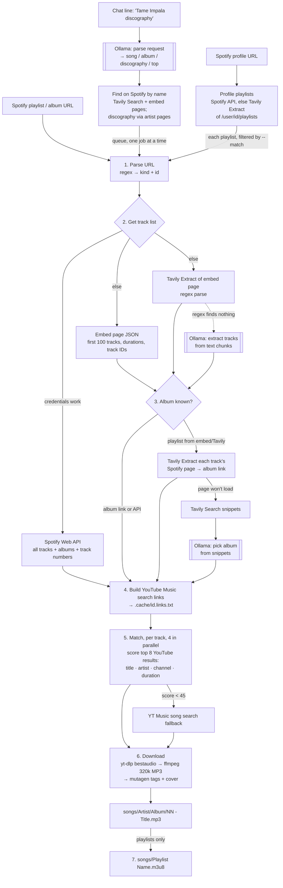

# yt-dl-agent

Turn Spotify playlists, albums, artists, songs or whole profiles into a local MP3 library, and tidy up
music you already have (`import`, `fix`). Paste
links, or just **chat**: type `Tame Impala discography` or `Sweater Weather by The Neighbourhood`.
Use it from the command line, or from the **web UI** (`yt-dl-agent serve`).

```
yt-dl-agent "https://open.spotify.com/playlist/48VKa8er36VggB0GUmQAFO"
```

It reads the track list from Spotify, builds a YouTube Music search link for each track, finds the
matching recording on YouTube, and downloads it as a **320 kbps MP3** with tags and cover art. Files are
organised as `songs/<Artist>/<Album>/`. Playlists also get a `.m3u8` playlist file with the original
playlist name.

Web lookups use the [Tavily API](https://tavily.com). A small local model running in
[Ollama](https://ollama.com) handles fuzzy text when parsing fails. For design details and test
results, see [project.md](project.md).

---

## Requirements

| What | Why | Install (Windows) |
|---|---|---|
| **Python 3.12+** | runs the app | [python.org](https://www.python.org/downloads/) |
| **ffmpeg** on PATH | converts audio to MP3, embeds cover art | `winget install Gyan.FFmpeg` |
| **Node.js** or **Deno** on PATH | yt-dlp needs a JS runtime for YouTube (Node.js also builds the web UI) | `winget install OpenJS.NodeJS.LTS` |
| **Ollama**, running, with a small model | parsing fallback, album lookup fallback | [ollama.com](https://ollama.com), then `ollama pull llama3.2` |
| **Tavily API key** | reads Spotify pages, looks up albums | free key at [app.tavily.com](https://app.tavily.com) |
| Spotify app credentials *(optional)* | full track lists past 100, exact albums and track numbers | [developer.spotify.com/dashboard](https://developer.spotify.com/dashboard) |

On macOS/Linux, get ffmpeg, node and ollama from your package manager (`brew install ffmpeg node ollama`).

> **Spotify API note:** Spotify now requires the developer account that owns the app to have
> **Premium**. Otherwise every request returns 403 "Active premium subscription required". The app
> works without it, but playlists are then capped at their **first 100 tracks**, and album names come
> from a web lookup instead of Spotify.

## Install

From the project folder:

```bash
python -m venv .venv
```

```bash
.venv\Scripts\python -m pip install -e .
```

(macOS/Linux: `.venv/bin/python -m pip install -e .`)

With [uv](https://docs.astral.sh/uv/) instead:

```bash
uv venv .venv -p 3.12
```

```bash
uv pip install -p .venv/Scripts/python.exe -e .
```

This installs the pinned `yt-dlp` (2026.08.19) and its extras, `tavily-python`, `ollama`, `mutagen`,
`pydantic`, `python-dotenv`, `rich`, and `fastapi` + `uvicorn` for the web UI.

To use the web UI, build it once (and again after updating the code):

```bash
npm --prefix web install
```

```bash
npm --prefix web run build
```

## Configure

Copy `.env.example` to `.env` and fill it in:

```
TAVILY_API_KEY=tvly-...
OLLAMA_HOST=http://localhost:11434
OLLAMA_MODEL=llama3.2:latest
SPOTIFY_CLIENT_ID=            # optional
SPOTIFY_CLIENT_SECRET=        # optional
```

`.env` is gitignored. Make sure Ollama is running (`ollama serve`, or the Ollama desktop app) before
you start.

**Run defaults** (optional) also live in `.env`. The web UI's Settings page writes them, and the command
line uses them as its defaults; a flag still wins.

```
YTDL_OUT=songs                 # library folder (--out)
YTDL_WORKERS=4                 # --workers
YTDL_BITRATE=320               # --bitrate
YTDL_NO_PLAYLIST=0             # 1 = --no-playlist
YTDL_NO_ALBUM_LOOKUP=0         # 1 = --no-album-lookup
YTDL_COOKIES_FROM_BROWSER=     # e.g. chrome
YTDL_YES=0                     # 1 = don't confirm chat requests
YTDL_LOG_DIR=logs              # --log-dir
```

## Web UI

```bash
.venv\Scripts\yt-dl-agent serve
```

Then open **http://127.0.0.1:8765**. It does everything the command line does:

| Page | What it's for |
|---|---|
| **Request & queue** | Type requests in plain words or paste links, check what it understood, queue them. Watch the running job live: phase, release *n* of *m*, songs reused / downloaded / failed, retries. Profile links show a playlist picker. **Options** sets this run's flags. |
| **History** | Every run, song by song: **downloaded**, **already in library** (skipped), **failed** with the reason, **removed** on Spotify, or the run failed outright. Open a run for the full lists, its log, and **Retry failed songs**. **Details** on a finished queue job opens its runs. Runs from before History existed are rebuilt from their logs. **Downloaded songs** lists the whole library by the day each file arrived. |
| **Songs** | The whole library: search, filter (in `Singles/`, in no playlist, imported, lossless, **failed**), and details per song: file, tags, the matched YouTube video, which playlists use it. A failed song shows why, and **Run "playlist" again** or **Download just this song**. |
| **Playlists & albums** | Every downloaded playlist and album with its status. **Sync** re-reads it from Spotify and fetches only what's new or failed; **Sync all playlists** does them all. Failed songs show why, with their YouTube Music search. |
| **Import files** / **Unsorted** | `import` with a **Preview** (dry run) first, results grouped as imported / upgraded / unsorted / already in library, and **Undo** for past imports. Unsorted lists files without a confident match, with the reason and any likely match. |
| **Fix library** | `fix`, with a preview of every album change and file move before you apply it. |
| **Run logs** | Every run's log, filterable by level and text. |
| **Settings** | Service checks (Spotify API, Tavily, Ollama, ffmpeg, JS runtime, yt-dlp) with what to do when one is missing, the `.env` keys, and the run defaults. |
| **Help & docs** | How everything works, searchable, plus troubleshooting. The (?) next to each page title opens its topic. |

`Ctrl+K` anywhere: type a request or paste a link, or jump to any page or playlist.

- Downloads go through the same **one-at-a-time queue** as chat. Import, fix and undo wait for the
  current download to finish writing before they touch the library.
- It only listens on `127.0.0.1` and only answers requests from this computer, so other web pages can't
  use it. API keys are shown masked.
- `--port 9000` changes the port. The API is documented at http://127.0.0.1:8765/api/docs.
- Developing the UI itself: see [web/README.md](web/README.md).

## Run

Run from the project folder. `.env` is read from the current directory, and output goes to `./songs`
by default.

**A playlist:** downloads every track and writes `songs/<Playlist Name>.m3u8`.

```bash
.venv\Scripts\yt-dl-agent "https://open.spotify.com/playlist/40R99ocNHdnFIcGTPT4ZB7"
```

**An album:** downloads to `songs/<Artist>/<Album>/01 - Title.mp3` …, with no playlist file.

```bash
.venv\Scripts\yt-dl-agent "https://open.spotify.com/album/3WmujGwOS0ANHkJRnMH6n8"
```

**Every public playlist on a profile:** each playlist is downloaded into the same library and gets its
own `.m3u8`. Tracks shared between playlists are downloaded only once.

```bash
.venv\Scripts\yt-dl-agent "https://open.spotify.com/user/divijpawar"
```

Profiles can have a lot of playlists, so list them first, then pick some by name:

```bash
.venv\Scripts\yt-dl-agent "https://open.spotify.com/user/divijpawar" --list
```

```bash
.venv\Scripts\yt-dl-agent "https://open.spotify.com/user/divijpawar" --match "night" --match "jim '24"
```

`--match` is a case-insensitive substring of the playlist name, and you can repeat it. Only playlists
shown on the profile are found. Private playlists, and public ones hidden from the profile, need their
own playlist link.

**A single song or an artist:** a track link downloads that song; an artist link downloads the
artist's whole discography (albums, EPs and singles).

```bash
.venv\Scripts\yt-dl-agent "https://open.spotify.com/artist/5INjqkS1o8h1imAzPqGZBb"
```

**Several at once:** links are processed one after another.

```bash
.venv\Scripts\yt-dl-agent "https://open.spotify.com/album/3WmujGwOS0ANHkJRnMH6n8" "https://open.spotify.com/playlist/40R99ocNHdnFIcGTPT4ZB7"
```

**Only build the YouTube Music search links**, without downloading:

```bash
.venv\Scripts\yt-dl-agent "https://open.spotify.com/playlist/40R99ocNHdnFIcGTPT4ZB7" --links-only
```

The links are written to `songs/.cache/<id>.links.txt`.

**Try a few tracks first:**

```bash
.venv\Scripts\yt-dl-agent "https://open.spotify.com/playlist/40R99ocNHdnFIcGTPT4ZB7" --limit 3
```

If you activate the venv first (`.venv\Scripts\activate`), you can type `yt-dl-agent` instead of
`.venv\Scripts\yt-dl-agent`. Links with `?si=...` tracking parameters work as-is.

### Chat: ask for artists, albums, songs, discographies

Run with no links (or `--chat`) and type what you want, one request per line:

```bash
.venv\Scripts\yt-dl-agent
```

```
> Tame Impala discography
I understood:
  - discography  Tame Impala (albums, EPs, singles)
Queue this? [Y/n]
Queued. (1 in the queue)

> Sweater Weather by The Neighbourhood, and the top songs of Bon Iver
I understood:
  - song         "Sweater Weather" by The Neighbourhood
  - top songs    Bon Iver
Queue these? [Y/n]
```

| You type | It downloads |
|---|---|
| `Tame Impala discography`, `everything by Bon Iver` | all of the artist's albums, EPs and singles |
| `all Lana Del Rey albums` | the artist's albums and EPs, without singles |
| `Currents by Tame Impala` | one album |
| `Sweater Weather by The Neighbourhood`, `Skinny Love and Holocene by Bon Iver` | individual songs |
| `top songs of Frank Ocean` | the artist's 10 most popular tracks |
| any Spotify link | playlist / album / track / artist (discography) / profile |

- **Confirm first.** It shows what it understood before queueing. If the small model misread you,
  answer `n` and rephrase, or use the exact form below. `--yes` skips the confirmation.
- **Queue.** Requests are downloaded **one at a time, in order**, in the background, so you can keep
  typing while it works. `queue` shows what's queued, running, done or failed. `quit` asks whether to
  wait for the rest.
- **Exact form** (skips the model, handy if Ollama is off): `song: <title> - <artist>`,
  `album: <title> - <artist>`, `discography: <artist>`, `albums: <artist>`, `top: <artist>`.
- **Forgiving lookups.** A "song" that turns out to be an album (`beach house bloom`) is downloaded as the
  album, and vice versa. A song Spotify search can't find is still searched on YouTube by title and
  artist.
- Everything goes into the same `songs/` library, with the same duplicate protection. Nothing already
  downloaded is fetched again.

Non-interactive, for scripts: each `--ask` is queued without confirmation, and the command exits when
everything is done.

```bash
.venv\Scripts\yt-dl-agent --ask "Tame Impala discography" --ask "Holocene by Bon Iver"
```

Chat limits (without the Spotify API):

- **Discographies come from Spotify's artist pages**, which load lazily, so a very prolific artist can
  come back incomplete. The run says how many releases it found, and the log lists them. Releases where
  the artist is only featured are skipped.
- **A single song may be filed under its single or soundtrack release** rather than the album, because
  that's the Spotify page search returned (e.g. `Sweater Weather/` instead of `I Love You./`). If the
  album version is already in your library, it's reused instead.

### Options

| Flag | Default | Meaning |
|---|---|---|
| `--out DIR` | `songs` | output folder |
| `--workers N` | `4` | parallel downloads (`1` = sequential; much higher risks YouTube throttling) |
| `--bitrate KBPS` | `320` | MP3 bitrate (320 is the MP3 maximum) |
| `--links-only` | | stop after building search links |
| `--no-playlist` | | don't write the `.m3u8` |
| `--no-album-lookup` | | skip the album lookup; everything goes to `Artist/Singles/` |
| `--limit N` | | only process the first N tracks (per playlist) |
| `--chat` | on when no links are given | type requests in plain words |
| `--ask TEXT` | | queue a plain-words request without confirming (repeatable) |
| `--yes` | | chat: don't ask to confirm each request |
| `--list` | | profile links: print the playlists and stop |
| `--match TEXT` | | profile links: only playlists whose name contains TEXT (repeatable) |
| `--log-dir DIR` | `logs` | where run logs are kept |
| `--dry-run` | | `import` / `fix`: show what would change, change nothing |
| `--undo [RUN]` | | `import`: reverse the last import (or a named one from `songs/.cache/imports/`) |
| `--cookies-from-browser chrome` | | use your browser's YouTube login; with YT Music Premium the source audio is better |
| `--port N` | `8765` | `serve`: port for the web UI |

The defaults for `--out`, `--workers`, `--bitrate`, `--no-playlist`, `--no-album-lookup`,
`--cookies-from-browser`, `--yes` and `--log-dir` can be changed in `.env` (`YTDL_*`, see
[Configure](#configure)) or on the web UI's Settings page.

### Re-running and keeping playlists in sync

Rerun the same link whenever the playlist changes on Spotify. The app re-reads the track list, which is
one quick request, and downloads **only the songs that aren't in your library yet**:

```
playlist 'Overnight' by Divij Pawar: 21 tracks (from embed)
20 songs already in the library; downloading 1 new
```

or, if nothing changed:

```
Up to date: all 21 songs already in the library; nothing to download
```

- **No duplicates across playlists and albums.** `songs/.cache/library.json` indexes every downloaded
  song by Spotify track ID and by artist + title, with a duration check so an extended mix isn't
  mistaken for the original. A song already downloaded from another playlist or album, even under a
  different file name or album folder, is reused instead of downloaded again. The new playlist's
  `.m3u8` points at the existing file.
- **Removed songs:** they're left out of the rewritten `.m3u8`, and the run says how many. The MP3s
  themselves are kept, since other playlists may use them.
- **Failed songs** are retried on the next run. The web UI lists them under **Failed songs**, with one-click
  retries.
- **Run history:** every run is recorded song by song in `songs/.cache/runs/` (downloaded, already in
  the library, failed and why, removed), from the command line, chat and the web UI alike. The web UI's
  **History** page shows it.
- **Album lookups** are cached in `songs/.cache/albums.json`, so known songs cost no Tavily credits.
- Deleted an MP3 by hand? It's simply downloaded again on the next run.

## Import your own songs

Bring in music you already have (old downloads, rips, a messy Downloads folder). The app identifies each
song on Spotify, cleans the tags, adds the album cover, and files a **copy** in the library.

```bash
.venv\Scripts\yt-dl-agent import "D:\Downloads\old music" --dry-run
```

```bash
.venv\Scripts\yt-dl-agent import "D:\Downloads\old music"
```

You can pass several files or folders; folders are searched recursively. In chat, type
`import D:\Downloads\old music`.

```
 + 03_tame_impala-the less i know the better (official video) [320kbps].mp3
     -> Tame Impala/Currents/07 - The Less I Know The Better.mp3
 ^ beach house - myth.flac
     -> Beach House/Bloom/01 - Myth.flac (better quality; old copy moved to _Replaced/)
 = The Neighbourhood - Sweater Weather.mp3: already in the library as The Neighbourhood/...
 ? Bon Iver - Skinny Love.mp3
     -> _Unsorted/Bon Iver - Skinny Love.mp3: length doesn't match
     maybe: Bon Iver - Skinny Love (Spotify 229s, file 60s): https://open.spotify.com/track/...
5 imported, 1 upgraded, 1 already in library, 2 to _Unsorted/, 0 errors
```

- **Your originals are never touched.** Files are copied, and keep their format: MP3, M4A, FLAC, Opus,
  Ogg and WAV are supported, and a FLAC stays a FLAC.
- **How it identifies a song:**
  - It reads the file's tags, its file name (junk like `(Official Video)`, `[320kbps]`, site names and
    track numbers is removed) and its folder names (`Artist/Album/song.mp3`).
  - For names it can't split, it asks the local model, which can also name the artist of a well-known
    song.
  - It searches Spotify, then **checks the length**: a match must be within 4 s of the file.
  - When a song exists on several releases (album, single, compilations, "slowed" versions), it prefers
    the album named in the file's tags or folder, then the artist's own release, then anything but a
    compilation.
- **Clean tags:** title, artist, album, album artist, track number, year and Spotify's 640×640 album cover.
  Junk is removed: comments, URL frames, "encoded by", site watermarks.
- **Unsure or unknown → `songs/_Unsorted/`.** A file whose length doesn't match, or that couldn't be
  identified at all, is copied to `_Unsorted/` with only cleaned title/artist tags. The reason, and any
  likely match, go in `songs/_Unsorted/_report.txt`. Fix the file name or tags there and run `fix` to retry.
- **Duplicates:** a song already in the library is skipped, unless the import is better: lossless beats
  lossy, or the bitrate is at least 32 kbps higher. A better copy replaces the old one, which moves to
  `songs/_Replaced/` (it's never deleted), and playlists are updated to point at the new file.
- **Re-running is cheap:** files imported before and unchanged since are skipped without any lookups.
- **Undo:** `import --undo` reverses the last import. It removes the copies, puts replaced files back,
  and updates the index and playlists.

```bash
.venv\Scripts\yt-dl-agent import --undo
```

## Fix the library

`fix` brings everything already in the library up to the same standard:

```bash
.venv\Scripts\yt-dl-agent fix --dry-run
```

```bash
.venv\Scripts\yt-dl-agent fix
```

- **Cover art:** replaces YouTube video thumbnails with Spotify's square album covers.
- **Albums:** re-checks every song's album on its own Spotify page. This corrects songs the Ollama
  fallback guessed wrong, and songs filed under `Singles` because no album was found at the time.
- **Missing details:** fills in track numbers, year and album artist.
- **Files follow their tags:** renames/moves files to their correct `Artist/Album/NN - Title` place.
  Playlist `.m3u8` files, the library index and the run records all follow automatically.
- **Untracked files:** finds audio files in the library that nothing tracks (copied in by hand, for
  example), identifies them and fixes them in place. Ones it can't identify are left alone.
- **`_Unsorted/` retry:** retries everything in `_Unsorted/`, and files that match now move into the
  library.
- **Never loses information:** a track number the file already had is kept if the album stays the same.

In chat, type `fix`. The first run on a big library uses roughly 1 Tavily credit per 5 songs, since
every song's Spotify page is read once. After that, results are cached.

## Logs

Every run writes a log to `logs/run-YYYYmmdd-HHMMSS.log` (change the folder with `--log-dir`). Logs are
kept, not overwritten. The path is printed at the end of each run.

The console shows short, plain-language messages. The log also has:

- which YouTube video each track matched, its duration vs Spotify's, and the match score
- every retry, with the raw error and traceback
- yt-dlp's own messages, tagged with the track they belong to
- album lookups that came from the search + Ollama fallback, so they're easy to double-check
- the raw Spotify / Tavily / Ollama errors behind each plain-language message

Example of what a temporary YouTube refusal looks like on the console:

```
  retry 1/2 The Neighbourhood - Sweater Weather: YouTube refused the download (HTTP 403 Forbidden). Usually temporary; rerun later, lower --workers, or update yt-dlp.
ok The Neighbourhood - Sweater Weather
```

## Output

```
songs/
├── Overnight.m3u8                      # playlists only, relative paths, original order
├── Ethel Cain/
│   └── Preacher's Daughter/
│       ├── 01 - Family Tree (Intro).mp3
│       └── ...
├── Parcels/
│   └── DayNight/
│       └── Once.mp3
└── .cache/
    ├── <id>.json                       # resolved tracks + per-track status
    ├── <id>.links.txt                  # YouTube Music search links
    └── albums.json                     # album lookup cache
```

- Folders use the primary artist (`"Artist A, Artist B"` → `Artist A`).
- Characters Windows doesn't allow in filenames are removed (`Day/Night` → `DayNight`). Leading and
  trailing dots are stripped too: a name starting with `.` (like `...Baby One More Time`) counts as a
  hidden file, and Plex never scans hidden files.
- Tracks with no known album go in `Artist/Singles/`.
- Track numbers come from the song's position on its album (Spotify's album page). Songs whose album
  couldn't be found have no prefix.
- Tags (title, artist, album, album artist, track number, year) come from Spotify's metadata, not
  YouTube's. The cover is Spotify's 640×640 album art; the YouTube thumbnail is only a fallback.
- `_Unsorted/` (imports that couldn't be matched, with `_report.txt`) and `_Replaced/` (older copies that
  a better import replaced) appear only when needed.
- Songs on compilations and soundtracks are filed under the album artist, e.g.
  `Various Artists/Wish I Was Here (Music From The Motion Picture)/05 - Holocene.mp3`.

## Workflow



| Step | What happens | Done by |
|---|---|---|
| 0a. Chat | A typed line → the model returns items like `{kind: album, artist: Tame Impala, title: Currents}`. Spotify links and the `album: … - …` form skip the model. After you confirm, each item is looked up on Spotify by name (Tavily Search, checked against the result page titles), and discographies are read from the artist's pages. Jobs run one at a time. | **Ollama** + Tavily |
| 0. Profile | For `/user/<id>` links: lists the public playlists via the Spotify API, otherwise Tavily Extract (advanced depth, up to 4 tries) of `/user/<id>/playlists`. If only the profile page loads, that shows about 10. Each playlist then runs through steps 1–7. | Spotify API / Tavily |
| 1. Parse URL | Pulls `playlist`/`album`/`user` and the ID out of the link (`?si=` is ignored). | code |
| 2. Track list | Tries the Spotify API, then the embed page JSON, then Tavily Extract of the embed page. | Spotify API / HTTP / Tavily |
| 2b. *Fallback* | If the Tavily page text can't be parsed by regex, it's split into ~1,500-char chunks and the model lists the songs. Songs whose title isn't in the text are dropped. | **Ollama** |
| 3. Albums | Albums already have their album name. For playlist tracks, Tavily fetches each track's Spotify page (20 per call, up to 4 retry rounds) and the album is read from its first album link. | Tavily + regex |
| 3b. *Fallback* | For tracks whose page never loads, a Tavily Search returns snippets and the model picks the album. The answer must appear in the snippets; generic answers like "Singles" are rejected. | Tavily + **Ollama** |
| 4. Links | `https://music.youtube.com/search?q=<artist>+<title>` for every track. | code |
| 5. Match | Scores the top 8 YouTube results; duration vs Spotify is the strongest signal. Live, cover, remix and sped-up versions are penalised unless the Spotify title has them. Below 45 points, the YT Music song search is tried; if that also fails, the track is skipped. | yt-dlp + code |
| 6. Download | Best audio stream → 320 kbps MP3. Tags come from Spotify: title, artist, album, album artist, track number (position on the album) and year. The 640×640 album cover is taken from each track's embed page, with no Tavily credits used. Up to 4 tracks at once. | yt-dlp, ffmpeg, mutagen |
| 7. Playlist | `.m3u8` with relative paths, in the original order, for playlists only. | code |

### Where Ollama is used

**In chat mode it understands your requests (step 0a).** That's the job a small model is good at:
`llama3.2` (3B) parsed 11 of 12 varied test phrasings correctly in about 3 s each, including multi-item
lines and a song named without its artist. That's why chat confirms before queueing.

**Otherwise, only in the two fallback steps (2b and 3b).** Everything else is deterministic code. That's
deliberate: in testing, `llama3.2` (3B) and `qwen2.5` (7B) each got only about 5 of 9 albums right from
search snippets, while reading the album straight off the Spotify page was close to 100%.

How often the fallbacks ran in testing:

| Test | 2b: track extraction | 3b: album pick |
|---|---|---|
| "Night Music" playlist (100 tracks) | 0 (embed page worked) | 13 tracks |
| "Overnight" playlist (21 tracks) | 0 | 3 tracks |
| *Preacher's Daughter* album (13 tracks) | 0 | 0 (album name known) |

If Ollama isn't running, nothing crashes. Chat says it can't understand the line and suggests the
exact `album: <title> - <artist>` form or a link. The tracks that needed the album fallback go to
`Artist/Singles/`, and a Tavily page that fails regex parsing counts as a failed source. With
`--no-album-lookup`, or when the Spotify API supplies albums, Ollama is only needed if the embed page
and the Tavily text both fail to parse.

## Troubleshooting

| Symptom | Cause / fix |
|---|---|
| `Spotify API 403: Active premium subscription required` | The Spotify app owner needs Premium. The app falls back automatically. It can take a few hours after subscribing before requests are allowed. |
| `embed source caps at 100 tracks` | Playlist has more than 100 tracks and the Spotify API isn't available. Only the first 100 are fetched. |
| `no confident match` for a track | Neither YouTube nor YouTube Music had a result close enough in title and duration. Usually a very obscure track or a region-locked upload. |
| `retry 1/2 ...: YouTube refused the download (HTTP 403 Forbidden)` | YouTube refused one stream link. Common and usually harmless: the track is retried up to 2 more times. If it still fails, it's listed in the summary; rerun later to retry just those. |
| `Spotify API not available: ... needs Premium (HTTP 403)` | Shown once per run. The app falls back to the embed page; see the Spotify API note above. |
| Lots of failures at once | Possibly YouTube throttling. Try `--workers 2`, or update yt-dlp: `.venv\Scripts\python -m pip install -U "yt-dlp[default]"`. |
| JS runtime / signature errors | Install Node.js or Deno and make sure it's on PATH. |
| Ollama connection errors | Start Ollama, and check `OLLAMA_HOST` and that `OLLAMA_MODEL` is pulled (`ollama list`). |
| Wrong album folder for a track | That album came from the search fallback. Run `fix`, which re-reads albums from Spotify; or fix the entry in `songs/.cache/albums.json`, delete the file, and rerun. |
| Web UI: "The UI isn't built yet, so only the API is served" | Run `npm --prefix web install` and `npm --prefix web run build`, then restart `serve`. |
| Web UI says "sample data" under its name | That's the UI dev server (`npm run dev`). Use `yt-dl-agent serve`, or `npm --prefix web run dev:live` with `serve` running. |
| Web UI: port already in use | Another `serve` is running, or pick another port: `serve --port 9000`. |

## Notes

- 320 kbps is the highest MP3 bitrate. YouTube audio is already lossy (about 130–160 kbps Opus), so
  the MP3 can't be better than the source.
- Tavily usage is roughly 1 credit per 20 track pages, plus 1 per fallback search. A 100-track playlist
  used about 55 credits.
- Download only content you have the right to. This tool is meant for personal use.
